# Movie Booking Backend API

A production-ready, high-performance backend API for movie booking systems, featuring **asymmetric JWT authentication (RS256)**, **hierarchical Role-Based Access Control (RBAC)**, **real-time seat locking and allocation using Socket.io**, **automated lock cleanup**, ** नेपाल-focused eSewa payment integration**, and **advanced rate-limiting controls**.

---

## 🏗️ System Architecture & Workflow

### Relationship Model

```
Movie 💳── Show ───💳 Theatre
           💳
           │
          Seat
           ▲
           │
        Booking ──💳 User
```

### Actor Profiles & Permissions

- **ROOT_ADMIN**: The system's superuser. Created directly in the database (no API endpoint exists). Has absolute access to all CRUD endpoints.
- **SYSTEM_ADMIN**: Created by the `ROOT_ADMIN`. Manages theatres, coordinates registrations, and exercises administrative oversight.
- **USER (Theatre Owner)**: Represents individuals who own one or more movie theatres. Authorized to create movies, schedule shows, and manage seat configurations for their own theatres.
- **CLIENT (Customer)**: Default role for all newly registered users. Authorized to browse movies/shows, view seat maps in real time, lock seats, book, cancel pending bookings, and make payments.
- **Unregistered Visitor**: Can browse movies, active theatres, scheduled shows, and see seat layouts without authenticating.

### Core Booking Workflow

```mermaid
sequenceDiagram
    autonumber
    actor Client as Client / Customer
    participant API as Backend API
    participant DB as MongoDB
    participant Socket as Socket.io Room
    participant eSewa as eSewa Gateway

    Client->>API: POST /seats/lock (locks seats for 5 mins)
    API->>DB: Atomic update: isLocked=true, lockExpiresAt
    API->>Socket: Emit seat:locked event
    API-->>Client: 200 OK (Seats locked)

    Client->>API: POST /booking (create pending booking)
    API->>DB: Verify seats are locked by user & not expired
    API->>DB: Create Booking in PENDING state
    API-->>Client: 201 Created (Booking ID returned)

    Client->>API: POST /payment/initiate (for eSewa payment)
    API->>DB: Create pending Payment record & compute signature hash
    API-->>Client: 200 OK (paymentHash & esewaUrl)

    Client->>eSewa: Redirect to eSewa with form data & signature hash
    Note over Client,eSewa: User completes payment on eSewa UI
    eSewa->>API: Redirect GET /payment/esewa/success?data=BASE64
    API->>API: Decode data & verify digital signature
    API->>eSewa: Verify transaction status out-of-band via eSewa verification API

    rect rgb(30, 40, 50)
        Note over API,DB: Begin Mongoose Atomic Session
        API->>DB: Set payment status to SUCCESS
        API->>DB: Set booking status to CONFIRMED, paymentStatus to PAID
        API->>DB: Update seats: isBooked=true, isLocked=false
        API->>DB: Decrement availableSeats count in Show
        Note over API,DB: Commit Mongoose Transaction
    end

    API->>Socket: Emit seat:booked event to room
    API-->>Client: 200 OK (Booking confirmed)
```



---

## 🚀 Key Features

### 🔑 1. Asymmetric JWT Authentication (RS256) & Token Rotation

- **Crypto Security**: Built using asymmetric cryptography (RS256). Tokens are signed with an RSA private key and verified with an RSA public key. The private key never leaves the authorization module.
- **Token Rotation**:
  - **Access Token**: Expires in `15 minutes`.
  - **Refresh Token**: Expires in `7 days`. Sent via HTTP-Only, Secure, SameSite=Strict cookies to protect against XSS and CSRF.
- **Revocation**: Stored securely as a bcrypt hash in the database, allowing immediate session invalidation when a user logs out, rotates passwords, or is suspended.

### 🛋️ 2. Real-Time Seat Locking & Background Cleanup

- **Realtime Sockets**: Connected users join room `show:${showId}`. Real-time events (`seat:locked`, `seat:released`, `seat:booked`) are broadcasted instantly to keep seat maps synchronized.
- **Lock Expiry**: Seats selected by a client are locked for `5 minutes`. An automated background worker runs every 60 seconds (`cleanupExpiredLocks`) to release expired locks, restoring seats to `AVAILABLE` status and notifying clients in real time.
- **Optimistic Seat Selection**: Prevents double-booking by filtering database updates atomically based on current lock states.

### 💳 3. eSewa Payment Integration

- **HMAC-SHA256 Signatures**: Generates a secure HMAC-SHA256 signature containing transaction details to prevent request tampering.
- **Base64 Callbacks**: Parses and processes base64-encoded transaction details returned from eSewa callbacks.
- **Double Verification**: Communicates out-of-band with eSewa's transaction status API (`rc-epay.esewa.com.np` in sandbox or `epay.esewa.com.np` in production) before completing any booking.
- **Atomic Transactions**: Handled using Mongoose sessions to ensure that booking updates, seat changes, payment records, and show capacity changes succeed or fail as a single unit.

### 🛡️ 4. Advanced Rate-Limiting Controls

IP-based rate limits can be easily bypassed by rotating proxy headers. This system employs custom multi-layered rate keying (`getKey` logic) using the following priorities:

1.  **Authenticated Requests**: Keyed on verified `userId` extracted from the JWT token. IP rotating has no effect.
2.  **Login/Register Requests**: Keyed on the SHA-256 hash of the payload `email` address. IP changes do not bypass brute force attempts on a single account.
3.  **Anonymous Public Requests**: Fallback key using the direct TCP connection remote socket address (`req.socket.remoteAddress`) rather than `req.ip` (which reads easily-manipulated header fields like `X-Forwarded-For`).

| Limiter               | Target                                        | Limit Details                   |
| :-------------------- | :-------------------------------------------- | :------------------------------ |
| **`generalLimiter`**  | Global application middleware                 | Max 100 requests per 15 minutes |
| **`authLimiter`**     | Auth Login/Register/Refresh routes            | Max 10 requests per 15 minutes  |
| **`seatLockLimiter`** | Seat Locking route (`POST /seats/lock`)       | Max 5 requests per 1 minute     |
| **`bookingLimiter`**  | Booking Creation route (`POST /booking`)      | Max 10 requests per 1 hour      |
| **`paymentLimiter`**  | Payment Initiation (`POST /payment/initiate`) | Max 5 requests per 1 hour       |

---

## 💾 Database Schema Design

### User Model (`User`)

- `name` (String, required, 2-50 chars)
- `email` (String, unique, lowercase, regex-validated)
- `password` (String, hashed, excluded from queries by default)
- `role` (Enum: `CLIENT`, `USER`, `SYSTEM_ADMIN`, `ROOT_ADMIN`, default: `CLIENT`)
- `refreshToken` (String, hashed, excluded from queries by default)

### Movie Model (`Movie`)

- `name` (String, required, 2-100 chars)
- `description` (String, required, 20-1000 chars)
- `casts` ([String], required)
- `trailerUrl` (String, required)
- `language` ([String], default: `["Nepali"]`)
- `releaseDate` (Date, required)
- `director` (String, required)
- `releaseStatus` (Enum: `PENDING`, `UPCOMING`, `RELEASED`, default: `PENDING`)
- `createdBy` (ObjectId ref: `User`, required)

### Theatre Model (`Theatre`)

- `name` (String, required, 2-100 chars)
- `description` (String, optional, max 500 chars)
- `city` (String, required)
- `postalCode` (String, required, 5 digits regex-validated)
- `address` (String, required, max 200 chars)
- `owner` (ObjectId ref: `User`, required)
- `createdBy` (ObjectId ref: `User`, required)

### Show Model (`Show`)

- `movie` (ObjectId ref: `Movie`, required)
- `theatre` (ObjectId ref: `Theatre`, required)
- `showTime` (Date, required)
- `totalSeats` (Number, required, min 1, max 200)
- `availableSeats` (Number, required)
- `standardPrice` (Number, default: 300)
- `premiumPrice` (Number, default: 500)
- `vipPrice` (Number, default: 700)
- `status` (Enum: `ACTIVE`, `CANCELLED`, `COMPLETED`, default: `ACTIVE`)
- `createdBy` (ObjectId ref: `User`, required)
- _Indexes_: Unique combination index `{ movie: 1, theatre: 1, showTime: 1 }`

### Seat Model (`Seat`)

- `show` (ObjectId ref: `Show`, required)
- `seatNumber` (String, required, e.g., "A1", "C5")
- `row` (String, required, e.g., "A", "O")
- `type` (Enum: `STANDARD`, `PREMIUM`, `VIP`, default: `STANDARD`)
- `price` (Number, required)
- `isBooked` (Boolean, default: false)
- `bookedBy` (ObjectId ref: `User`, default: null)
- `isLocked` (Boolean, default: false)
- `lockedBy` (ObjectId ref: `User`, default: null)
- `lockedAt` (Date, default: null)
- `lockExpiresAt` (Date, default: null)
- _Indexes_: Unique seat checker `{ show: 1, seatNumber: 1 }`

#### 🛋️ Seat Map Details

When a Show is created, `totalSeats` (max 200) are generated dynamically according to this layout rules:

- **STANDARD** (Rows A-F, closest to screen): Base standard price plus index-based addition (`+Rs. 10` per row).
- **PREMIUM** (Rows G-N, middle rows): Base premium price plus index-based addition (`+Rs. 10` per row, capped at `Rs. 600`).
- **VIP** (Rows O-T, back rows): Comfort VIP seats priced progressively at `[Rs. 700, 750, 800, 850, 900, 1000]`.

### Booking Model (`Booking`)

- `user` (ObjectId ref: `User`, required)
- `show` (ObjectId ref: `Show`, required)
- `seats` ([ObjectId ref: Seat], required, min 1 seat)
- `totalAmount` (Number, required)
- `status` (Enum: `PENDING`, `CONFIRMED`, `CANCELLED`, `REFUNDED`, default: `PENDING`)
- `paymentStatus` (Enum: `PENDING`, `PAID`, `FAILED`, `REFUNDED`, default: `PENDING`)
- `paymentId` (String, default: null)
- `bookedAt` (Date, default: Date.now)
- `cancelledAt` (Date, default: null)

### Payment Model (`Payment`)

- `booking` (ObjectId ref: `Booking`, required)
- `user` (ObjectId ref: `User`, required)
- `amount` (Number, required)
- `status` (Enum: `PENDING`, `SUCCESS`, `FAILED`, `REFUNDED`, default: `PENDING`)
- `transactionId` (String, unique, required)
- `paymentDate` (Date, default: null)

---

## 🔀 API Route Documentation

All API routes are prefixed by `/api/v1` except for the health check and static Swagger docs.

### 🔑 Authentication Routes (Prefix: `/api/v1/auth`)

#### `POST /auth/register`

- **Description**: Registers a new user. Default role assigned is `CLIENT`.
- **Auth Required**: None (Public)
- **Rate Limiter**: `authLimiter`
- **Request Body**:
  ```json
  {
    "name": "Ajay Tamang",
    "email": "ajay@gmail.com",
    "password": "SecurePassword123"
  }
  ```
- **Success Response** (201 Created):
  - Sets HTTP-Only cookie `refreshToken`.
  ```json
  {
    "success": true,
    "accessToken": "eyJhbGciOiJSUzI1NiIsIn...",
    "user": {
      "id": "64abc123def...",
      "name": "Ajay Tamang",
      "email": "ajay@gmail.com",
      "role": "CLIENT"
    }
  }
  ```

#### `POST /auth/login`

- **Description**: Authenticates user credentials. Returns accessToken and sets refreshToken cookie.
- **Auth Required**: None (Public)
- **Rate Limiter**: `authLimiter`
- **Request Body**:
  ```json
  {
    "email": "ajay@gmail.com",
    "password": "SecurePassword123"
  }
  ```
- **Success Response** (200 OK): Same schema as registration response.

#### `POST /auth/refresh`

- **Description**: Generates a new access token using the HTTP-Only cookie `refreshToken` and rotates refresh tokens.
- **Auth Required**: Cookie with `refreshToken`
- **Rate Limiter**: `authLimiter`
- **Success Response** (200 OK):
  - Sets HTTP-Only cookie with rotated `newRefreshToken`.
  ```json
  {
    "success": true,
    "newAccessToken": "eyJhbGciOiJSUzI1Ni..."
  }
  ```

#### `POST /auth/logout`

- **Description**: Invalidates the user session. Clears the refresh token hash from the database and deletes the client cookie.
- **Auth Required**: Cookie with `refreshToken`
- **Success Response** (200 OK):
  ```json
  {
    "success": true,
    "message": "Logout Successfully"
  }
  ```

#### `GET /auth/me`

- **Description**: Returns details of the currently authenticated user session.
- **Auth Required**: Bearer Access Token
- **Success Response** (200 OK):
  ```json
  {
    "success": true,
    "user": {
      "id": "64abc123def...",
      "name": "Ajay Tamang",
      "email": "ajay@gmail.com",
      "role": "CLIENT"
    }
  }
  ```

---

### 🎬 Movie Routes (Prefix: `/api/v1`)

#### `GET /movies`

- **Description**: Fetches all movies registered in the system.
- **Auth Required**: None (Public)
- **Success Response** (200 OK): Returns list of all movie documents.

#### `GET /movies/search`

- **Description**: Searches movies using filters. Searches on `name` and `director` are case-insensitive and allow partial matches.
- **Auth Required**: None (Public)
- **Query Parameters**:
  - `name` (String, optional)
  - `director` (String, optional)
  - `language` (String, optional)
  - `releaseStatus` (Enum: `PENDING`, `UPCOMING`, `RELEASED`, optional)
- **Success Response** (200 OK): Returns a matching list of movies.

#### `GET /movie/:id`

- **Description**: Retrieve details of a specific movie.
- **Auth Required**: None (Public)
- **Success Response** (200 OK): Returns the specific movie document.

#### `POST /movie`

- **Description**: Creates a new movie entry.
- **Auth Required**: Bearer Token (`USER`, `SYSTEM_ADMIN`, `ROOT_ADMIN`)
- **Request Body**:
  ```json
  {
    "name": "Interstellar",
    "description": "A team of explorers travel through a wormhole...",
    "casts": ["Matthew McConaughey", "Anne Hathaway"],
    "trailerUrl": "https://www.youtube.com/watch?v=zSWdZVtXT7E",
    "language": ["English"],
    "releaseDate": "2014-11-07",
    "director": "Christopher Nolan",
    "releaseStatus": "RELEASED"
  }
  ```
- **Success Response** (201 Created): Returns created movie document.

#### `PATCH /movie/:id`

- **Description**: Updates a movie details. Users with `USER` role can only update movies they created.
- **Auth Required**: Bearer Token (`USER`, `SYSTEM_ADMIN`, `ROOT_ADMIN`)
- **Success Response** (200 OK): Returns the updated movie document.

#### `DELETE /movie/:id`

- **Description**: Deletes a specific movie. Users with `USER` role can only delete movies they created.
- **Auth Required**: Bearer Token (`USER`, `SYSTEM_ADMIN`, `ROOT_ADMIN`)
- **Success Response** (200 OK): Returns the deleted movie details.

---

### 🏢 Theatre Routes (Prefix: `/api/v1`)

#### `GET /theatres`

- **Description**: Lists all physical theatres.
- **Auth Required**: None (Public)
- **Success Response** (200 OK): Returns array of theatres.

#### `GET /theatre/:id`

- **Description**: Fetch detailed information of a specific theatre.
- **Auth Required**: None (Public)
- **Success Response** (200 OK): Returns the theatre details.

#### `POST /theatre`

- **Description**: Creates a new theatre.
- **Auth Required**: Bearer Token (`SYSTEM_ADMIN`, `ROOT_ADMIN`)
- **Request Body**:
  ```json
  {
    "name": "QFX Cinemas Labim Mall",
    "description": "Modern multiplex cinema in Lalitpur",
    "city": "Lalitpur",
    "postalCode": "44700",
    "address": "Labim Mall, Pulchowk",
    "owner": "64dw7h29hsey...",
    "createdBy": "64abc456def..."
  }
  ```
- **Success Response** (201 Created): Returns created theatre document.

#### `PATCH /theatre/:id`

- **Description**: Updates theatre information.
- **Auth Required**: Bearer Token (`SYSTEM_ADMIN`, `ROOT_ADMIN`)
- **Success Response** (200 OK): Returns updated theatre.

#### `DELETE /theatre/:id`

- **Description**: Deletes a theatre.
- **Auth Required**: Bearer Token (`SYSTEM_ADMIN`, `ROOT_ADMIN`)
- **Success Response** (200 OK): Returns deleted theatre metadata.

---

### 📅 Show Routes (Prefix: `/api/v1`)

#### `GET /shows`

- **Description**: Lists all active shows, sorted by show time in ascending order.
- **Auth Required**: None (Public)
- **Success Response** (200 OK): List of active shows populated with movie and theatre details.

#### `GET /shows/movie/:movieId`

- **Description**: Retrieve active shows playing a particular movie.
- **Auth Required**: None (Public)
- **Success Response** (200 OK): Array of active show documents.

#### `GET /shows/theatre/:theatreId`

- **Description**: Retrieve active shows scheduled at a particular theatre.
- **Auth Required**: None (Public)
- **Success Response** (200 OK): Array of active show documents.

#### `GET /show/:id`

- **Description**: Retrieves show details along with its current seat map.
- **Auth Required**: None (Public)
- **Success Response** (200 OK):
  ```json
  {
    "success": true,
    "show": { ...showDetails },
    "seats": [
      {
        "seatNumber": "A1",
        "row": "A",
        "type": "STANDARD",
        "price": 300,
        "isBooked": false,
        "isLocked": false
      }
    ]
  }
  ```

#### `GET /shows/my-shows`

- **Description**: Returns paginated shows created by the logged-in user (Theatre Owner).
- **Auth Required**: Bearer Token (`USER`, `SYSTEM_ADMIN`, `ROOT_ADMIN`)
- **Query Parameters**:
  - `page` (Number, optional, default: 1)
  - `limit` (Number, optional, default: 10)
- **Success Response** (200 OK): Paginated show details.

#### `POST /show`

- **Description**: Creates a new show and automatically generates seat configurations (based on standard pricing formulas). Users can only create shows at theatres they own.
- **Auth Required**: Bearer Token (`USER`, `SYSTEM_ADMIN`, `ROOT_ADMIN`)
- **Request Body**:
  ```json
  {
    "movie": "64abc123def...",
    "theatre": "64abc555def...",
    "showTime": "2026-12-25T18:30:00.000Z",
    "totalSeats": 200,
    "standardPrice": 300,
    "premiumPrice": 500,
    "vipPrice": 700
  }
  ```
- **Success Response** (201 Created): Show object returned.

#### `PATCH /show/:id`

- **Description**: Modifies the `showTime` of a show. Only allowed if **no seats are locked or booked** to avoid race conditions.
- **Auth Required**: Bearer Token (`USER`, `SYSTEM_ADMIN`, `ROOT_ADMIN`)
- **Request Body**:
  ```json
  {
    "showTime": "2026-12-25T20:00:00.000Z"
  }
  ```
- **Success Response** (200 OK): Updated show details.

#### `PATCH /show/:id/cancel`

- **Description**: Cancels a scheduled show. Status set to `CANCELLED`.
- **Auth Required**: Bearer Token (`USER`, `SYSTEM_ADMIN`, `ROOT_ADMIN`)
- **Success Response** (200 OK): Success cancellation message.

#### `DELETE /show/:id`

- **Description**: Deletes a show and deletes all generated seats. Only allowed if **no bookings or locks exist** for the show.
- **Auth Required**: Bearer Token (`USER`, `SYSTEM_ADMIN`, `ROOT_ADMIN`)
- **Success Response** (200 OK): Success deletion message.

---

### 🛋️ Seat Routes (Prefix: `/api/v1`)

#### `GET /seats/:showId`

- **Description**: Fetches seat map states, dynamic lock status, owner indicators, and count summaries.
- **Auth Required**: None (Public)
- **Success Response** (200 OK):
  ```json
  {
    "success": true,
    "summary": {
      "total": 200,
      "available": 195,
      "locked": 3,
      "myLocked": 2,
      "booked": 0
    },
    "seats": [
      {
        "_id": "64abc333def...",
        "seatNumber": "A1",
        "row": "A",
        "type": "STANDARD",
        "price": 300,
        "isBooked": false,
        "isLocked": true,
        "isLockedByMe": true,
        "lockExpiresAt": "2026-07-08T10:15:00.000Z",
        "state": "MY_LOCK"
      }
    ]
  }
  ```

#### `POST /seats/lock`

- **Description**: Locks selection of seats for 5 minutes prior to payment completion. If any seat is already locked or booked, request is aborted. Emits `seat:locked` to socket room.
- **Auth Required**: Bearer Token (`CLIENT`, `SYSTEM_ADMIN`, `ROOT_ADMIN`)
- **Rate Limiter**: `seatLockLimiter`
- **Request Body**:
  ```json
  {
    "showId": "64abc999def...",
    "seatIds": ["64abc333def...", "64abc334def..."]
  }
  ```
- **Success Response** (200 OK):
  ```json
  {
    "success": true,
    "message": "Seats locked successfully",
    "lockExpiresAt": "2026-07-08T10:15:00.000Z"
  }
  ```

#### `POST /seats/release`

- **Description**: Explicitly releases locked seats when user cancels selection. Emits `seat:released` to socket room.
- **Auth Required**: Bearer Token (`CLIENT`, `SYSTEM_ADMIN`, `ROOT_ADMIN`)
- **Request Body**: Same format as `lock` body.
- **Success Response** (200 OK): Returns success confirmation.

---

### 🧾 Booking Routes (Prefix: `/api/v1`)

#### `POST /booking`

- **Description**: Creates a reservation booking in a `PENDING` state. Verifies that the requested seats are currently locked by the logged-in user and haven't expired.
- **Auth Required**: Bearer Token (`CLIENT`, `SYSTEM_ADMIN`, `ROOT_ADMIN`)
- **Rate Limiter**: `bookingLimiter`
- **Request Body**:
  ```json
  {
    "show": "64abc999def...",
    "seats": ["64abc333def...", "64abc334def..."]
  }
  ```
- **Success Response** (201 Created):
  ```json
  {
    "success": true,
    "booking": {
      "_id": "64abcf11def...",
      "user": "64abc123def...",
      "show": "64abc999def...",
      "seats": ["64abc333def...", "64abc334def..."],
      "totalAmount": 600,
      "status": "PENDING",
      "paymentStatus": "PENDING",
      "bookedAt": "2026-07-08T10:10:00.000Z"
    },
    "totalAmount": 600,
    "message": "Booking created — proceed to payment"
  }
  ```

#### `GET /bookings/my`

- **Description**: Fetches bookings history of the authenticated user, sorted by date (latest first).
- **Auth Required**: Bearer Token (`CLIENT`, `SYSTEM_ADMIN`, `ROOT_ADMIN`)
- **Success Response** (200 OK): List of user's bookings with populated movie, theater, and seat details.

#### `GET /booking/:id`

- **Description**: Fetch detailed info of a booking. Normal users can only retrieve bookings they own.
- **Auth Required**: Bearer Token (`CLIENT`, `SYSTEM_ADMIN`, `ROOT_ADMIN`)
- **Success Response** (200 OK): Populated booking details.

#### `PATCH /booking/:id/cancel`

- **Description**: Cancels a booking. If status was unpaid, updates to `CANCELLED`, resets seat locks, updates show capacity, and emits release socket event. If booking was paid (`PAID`), updates status to `REFUNDED` and handles state changes.
- **Auth Required**: Bearer Token (`CLIENT`, `SYSTEM_ADMIN`, `ROOT_ADMIN`)
- **Success Response** (200 OK): Cancellation confirmation message.

---

### 💳 Payment Routes (Prefix: `/api/v1`)

#### `POST /payment/initiate`

- **Description**: Generates eSewa digital signature details and redirects/form action endpoint payload for the booking.
- **Auth Required**: Bearer Token (`CLIENT`, `SYSTEM_ADMIN`, `ROOT_ADMIN`)
- **Rate Limiter**: `paymentLimiter`
- **Request Body**:
  ```json
  {
    "bookingId": "64abcf11def..."
  }
  ```
- **Success Response** (200 OK):
  ```json
  {
    "success": true,
    "paymentHash": {
      "amount": 600,
      "tax_amount": 0,
      "total_amount": 600,
      "transaction_uuid": "64abcf11def...-17865243",
      "product_code": "EPAYTEST",
      "product_service_charge": 0,
      "product_delivery_charge": 0,
      "success_url": "http://localhost:4000/api/v1/payment/esewa/success",
      "failure_url": "http://localhost:4000/api/v1/payment/esewa/failure",
      "signed_field_names": "total_amount,transaction_uuid,product_code",
      "signature": "V3b85S..."
    },
    "esewaUrl": "https://rc-epay.esewa.com.np/api/epay/main/v2/form"
  }
  ```

#### `GET /payment/esewa/success`

- **Description**: eSewa success callback. Verifies HMAC signature of payload, queries out-of-band transaction status API, starts a session transaction to confirm booking and release locks, and emits `seat:booked` event.
- **Auth Required**: None (Public callback)
- **Query Parameters**:
  - `data` (String, Base64 transaction details from eSewa)
- **Success Response** (200 OK): Confirmation JSON.
  ```json
  {
    "success": true,
    "message": "Payment successful and booking confirmed",
    "bookingId": "64abcf11def..."
  }
  ```

#### `GET /payment/esewa/failure`

- **Description**: eSewa failure callback. Marks payment status as `FAILED` and resets booking status to `FAILED`.
- **Auth Required**: None (Public callback)
- **Query Parameters**:
  - `data` (String, Base64 details, optional)
- **Success Response** (200 OK): Failed status notification message.

#### `GET /payment/status/:bookingId`

- **Description**: Retrieve the status of the payment record associated with a booking.
- **Auth Required**: Bearer Token (`CLIENT`, `SYSTEM_ADMIN`, `ROOT_ADMIN`)
- **Success Response** (200 OK): Returns the payment record.

---

### 🔌 Socket.io Events Reference

Authenticates sockets with JWT via handshake verification parameter `socket.handshake.auth.token`.

- **Client Emits**:
  - `join:show` (payload: `showId` string): Joins socket room `show:${showId}` to receive real-time seat changes.
  - `leave:show` (payload: `showId` string): Leaves room `show:${showId}`.
- **Server Broadcasts** (to room `show:${showId}`):
  - `seat:locked` (payload: `{ seatIds: string[], lockedBy: string, lockExpiresAt: Date }`)
  - `seat:released` (payload: `{ seatIds: string[] }`)
  - `seat:booked` (payload: `{ seatIds: string[] }`)

---

## 🛠️ Configuration & Setup

### Environment Variables (`.env`)

Create a `.env` file in the root directory:

```ini
PORT=4000
MONGO_DB_URL=your_mongodb_connection_string
NODE_ENV=development # development | production
ESEWA_SECRET_KEY=your_esewa_secret_key
ESEWA_PRODUCT_CODE=your_esewa_product_code # e.g. EPAYTEST
BACKEND_URL=http://localhost:4000
FRONTEND_URL=http://localhost:3000
```

### Setup Guide

1.  **Install Dependencies**:

    ```bash
    npm install
    ```

2.  **Generate RSA Key Pair (RS256 JWT)**:
    Create a directory `src/keys/` and generate keys using OpenSSL:

    ```bash
    mkdir -p src/keys

    # Generate private key
    openssl genrsa -out src/keys/private.pem 2048

    # Generate public key
    openssl rsa -in src/keys/private.pem -pubout -out src/keys/public.pem
    ```

3.  **Seed Database (Optional)**:
    Seeding scripts exist to pre-fill standard entries for movies and theatres:

    ```bash
    # Seed Movies
    npm run seed:movie

    # Seed Theatres
    npm run seed:theatre
    ```

4.  **Run Development Server**:
    Starts development mode using `tsx` watcher:

    ```bash
    npm run dev
    ```

5.  **Build and Start Production Server**:

    ```bash
    # Build TS
    npm run build

    # Start production build
    npm start
    ```

---

## 📖 Swagger API Documentation

Run the server and navigate to:

```
http://localhost:4000/api/v1/docs
```

to access the interactive swagger documentation.
